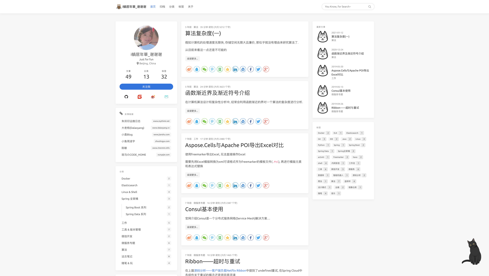

[](https://nodejs.org/)
[](https://hexo.io/)

[English](./README.md) | 简体中文

---

# hexo-icarus-blog

基于 [Hexo](https://hexo.io/) 的简洁、优雅、强大的静态博客框架。



## 部署

生成的输出目录：`.deploy_git`（移动时可忽略）

部署到 GitHub Pages 或 Gitee Pages：

```bash
hexo clean && hexo g && gulp && hexo d
```

| 命令 | 说明 |
|------|------|
| `hexo clean` | 清理缓存文件 |
| `hexo g` | 生成静态文件 |
| `hexo s` | 启动本地服务器（预览） |
| `gulp` | 压缩 HTML/CSS/JS/图片 |
| `hexo d` | 部署到远程 |

## 配置

编辑 `_config.yml`：

```yml
deploy:
  type: git
  repository: git@github.com:username/username.github.io.git
  branch: master
```

## 特性

- **Icarus 主题** — 简洁、响应式设计，支持自定义
- **Live2D 组件** — 交互式 hijiki 看板娘
- **Gulp 流水线** — 自动化资源压缩
- **Markdown** — 使用 Markdown 撰写文章

## 定制

基于 [hexo-theme-icarus](https://github.com/ppoffice/hexo-theme-icarus) 进行了以下定制：

- **导航栏** — 自定义图标 + 文字 Logo；嵌入搜索输入框
- **个人资料组件** — 新增微信、码云、微博链接
- **友情链接组件** — 标题前添加图标
- **文章时间** — 列表页显示相对时间，文章页显示绝对时间
- **缩略图** — 在文章页隐藏，减少视觉干扰
- **摘要** — 去除文章摘要中的 HTML 标签（更整洁的排版）
- **文章布局** — 双栏布局（相比默认三栏，内容区域更宽）
- **目录** — 默认开启；长文章支持目录粘性滚动
- **版权声明** — 文章底部添加版权信息
- **页脚** — 自定义站点信息
- **Live2D** — 全站显示交互式 hijiki 看板娘

## 许可证

MIT
